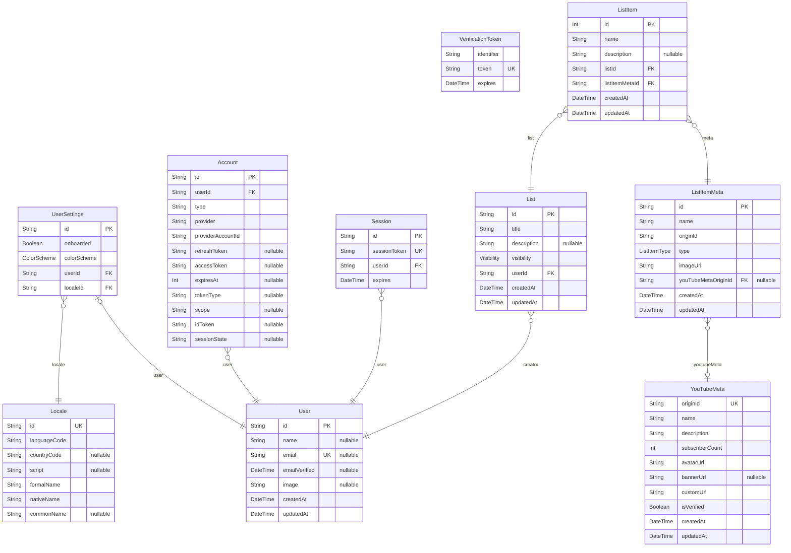

# YouTubeMate
> Generated by [`prisma-markdown`](https://github.com/samchon/prisma-markdown)

- [default](#default)

## default

### `User`
This comment will get attached to the `User` node in the AST

**Properties**
  - `id`: Primary Key.
  - `name`: Name of user.
  - `email`: Email address.
  - `emailVerified`: Email Verification time of user.
  - `image`: Avatar of user.
  - `createdAt`: Creation time of user.
  - `updatedAt`: Update time of user.

### `UserSettings`
This comment will get attached to the `UserSettings` node in the AST

**Properties**
  - `id`: Primary Key.
  - `onboarded`: Whether the user is onboarded or not.
  - `colorScheme`: 
  - `userId`: Belong user id.
  - `localeId`: Belong locale id.

### `Locale`
This comment will get attached to the `Locale` node in the AST

**Properties**
  - `id`: Primary Key.
  - `languageCode`: Language code.
  - `countryCode`: Country code.
  - `script`: 
  - `formalName`: Formal locale name.
  - `nativeName`: Native locale name.
  - `commonName`: Common locale name.

### `Account`
This comment will get attached to the `Account` node in the AST

**Properties**
  - `id`: Primary Key.
  - `userId`: Belong user id.
  - `type`: Account type.
  - `provider`: Account provider.
  - `providerAccountId`: Account provider id.
  - `refreshToken`: Account refresh token.
  - `accessToken`: Account access token.
  - `expiresAt`: Expiration day(s) value.
  - `tokenType`: Account token type.
  - `scope`: Account scope.
  - `idToken`: Account token id.
  - `sessionState`: Account session state.

### `Session`
This comment will get attached to the `Session` node in the AST

**Properties**
  - `id`: Primary Key.
  - `sessionToken`: Session token.
  - `userId`: Belong user id.
  - `expires`: Expiration session date.

### `VerificationToken`
This comment will get attached to the `VerificationToken` node in the AST

**Properties**
  - `identifier`: Verification token identifier.
  - `token`: Verification token.
  - `expires`: Verification token expiration date.

### `List`
This comment will get attached to the `List` node in the AST

**Properties**
  - `id`: Primary Key.
  - `title`: List title.
  - `description`: List description.
  - `visibility`: Visibility of list.
  - `userId`: Belong user id.
  - `createdAt`: Creation time of list.
  - `updatedAt`: Update time of list.

### `ListItem`
This comment will get attached to the `ListItem` node in the AST

**Properties**
  - `id`: Primary Key.
  - `name`: List item name.
  - `description`: List item description.
  - `listId`: Belong list id.
  - `listItemMetaId`: Belong list item meta id.
  - `createdAt`: Creation time of list item.
  - `updatedAt`: Update time of list item.

### `ListItemMeta`
This comment will get attached to the `ListItemMeta` node in the AST

**Properties**
  - `id`: Primary Key.
  - `name`: List item meta name.
  - `originId`: List item meta origin id.
  - `type`: List item meta type.
  - `imageUrl`: List item meta image url.
  - `youTubeMetaOriginId`: Belong YouTube meta origin id.
  - `createdAt`: Creation time of list item meta.
  - `updatedAt`: Update time of list item meta.

### `YouTubeMeta`

**Properties**
  - `originId`: YouTube meta origin id.
  - `name`: YouTube meta name.
  - `description`: YouTube meta description.
  - `subscriberCount`: YouTube meta subscriber count.
  - `avatarUrl`: YouTube meta avatar url.
  - `bannerUrl`: YouTube meta banner url.
  - `customUrl`: YouTube meta custom url.
  - `isVerified`: YouTube meta is verified.
  - `createdAt`: Creation time of YouTube meta.
  - `updatedAt`: Update time of YouTube meta.